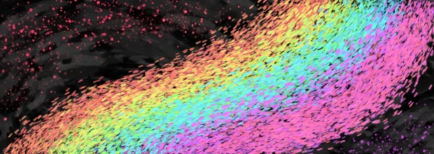
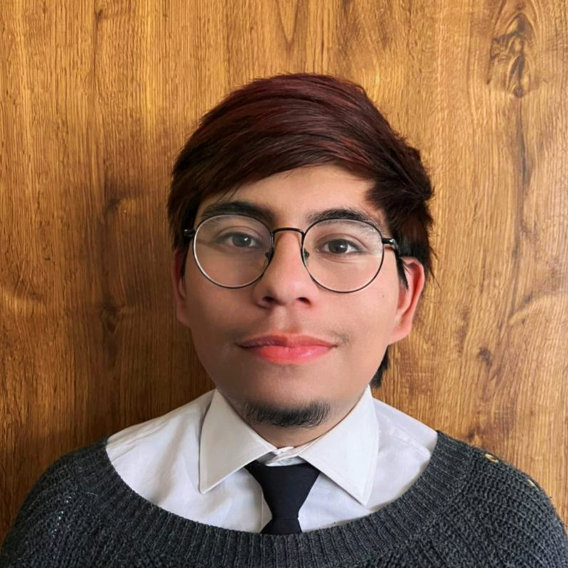
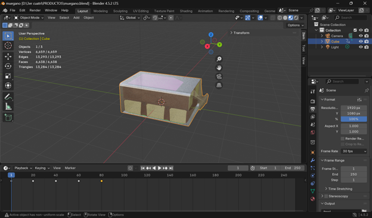
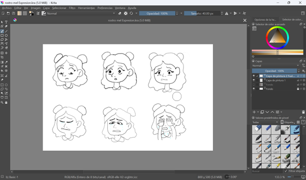
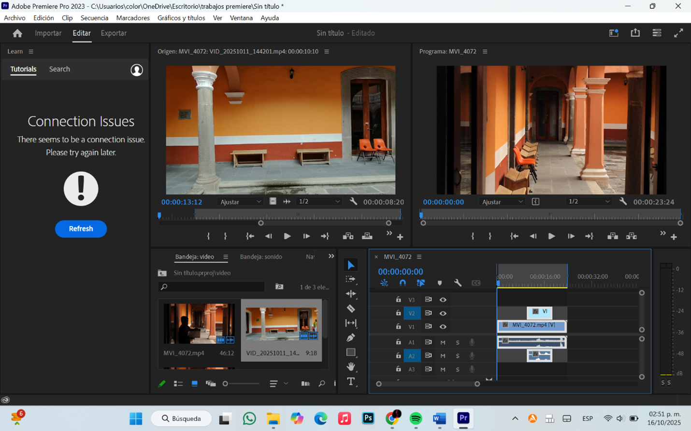
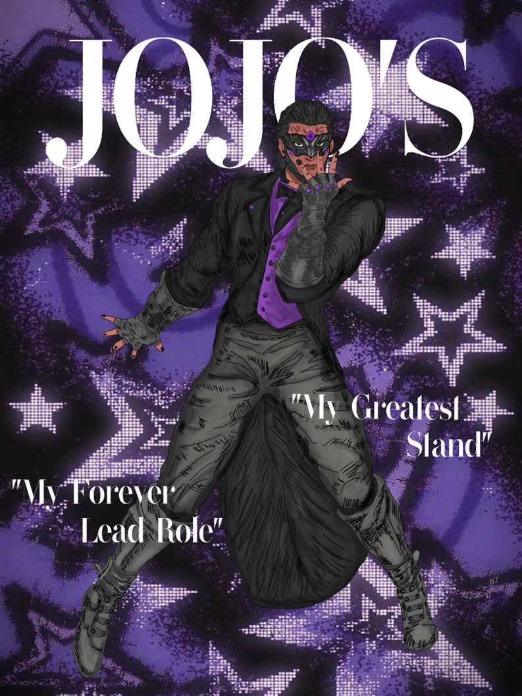

# 👨‍💻 Ruben Abrahan De los Santos Ruesga 
# Estudiante de la Carrera de Entornos Virtuales y Negocios Digitales 5°A
# Universidad Tecnologica de Tlaxcala

---

# 👋 Bienvenido a mi CV Digital

<!-- ESPACIO PARA TU FOTO -->

---

## 🌐 Redes Profesionales

---

# 🧑 Sobre mí

Mi nombre es **Ruben Abrahan De los Santos Ruesga**, tengo **21 años**.  
Soy originario de **Ciudad de México**, aunque actualmente vivo en **Huamantla, Tlaxcala**.

Soy una persona **creativa, autodidacta y multifacética** siento que soy muy bueno en lo que hago y en lo que me pongo como meta, jamás me he sentido insatisfecho con mis proyectos y me considero una persona muy apasionada por:

🎭 Teatro  
🎬 Producción audiovisual  
🎨 Arte digital  
💻 Tecnología  
📸 Fotografía  

Formo parte de la compañía **Teatro Vacío**, donde participo en proyectos escénicos y culturales.

Me encanta **crear personajes, contar historias y desarrollar proyectos creativos** tanto en el ámbito artístico como tecnológico.

---

# 🧠 Habilidades Técnicas

- Manejo de software creativo y digital
- Edición de imagen y video
- Organización de proyectos
- Redacción de reportes
- Gestión de redes sociales
- Creación de contenido
- Planeación de proyectos escénicos
- Atención al público

---

# 🌟 Habilidades Personales

- Trabajo en equipo
- Comunicación efectiva
- Creatividad
- Liderazgo
- Empatía
- Adaptabilidad
- Resolución de problemas
- Disciplina
- Hablar en público

---

# 🛠 Software que manejo

---

# 💻 Lenguajes de programación

---

# 🎨 Proyectos Visuales

## Modelado 3D en Blender

---

## Expresiones de personaje (Krita)

---

## Edición de Cortometraje (Adobe Premiere)

---

## Dibujo estilo portada Vogue en Krita

---

# 🎬 Proyectos en Video

### 📊 Usabilidad Base de Datos

---

### 🛍 Usabilidad Catálogo Digital

---

### 🎥 Cortometraje "Lo que no se dice"

---

### 🎞 Animación 2D "Mr. Cascabel"

---

# 🏆 Reconocimientos y Certificados

---

# 📬 Contacto

📧 **Correo**

rubensito3450@gmail.com  
rubenruesga03@gmail.com  

📱 **Teléfono**

2471304524

---

⭐ *Gracias por visitar mi perfil profesional*
